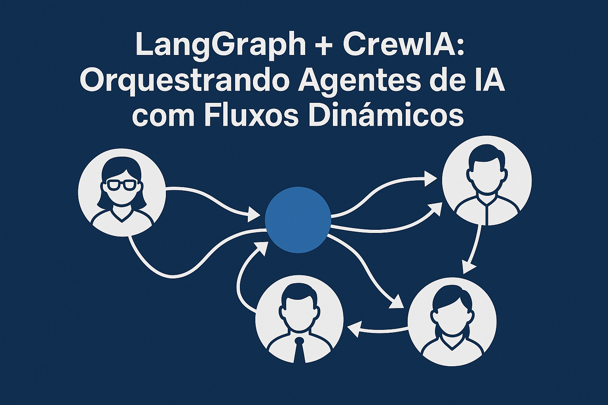
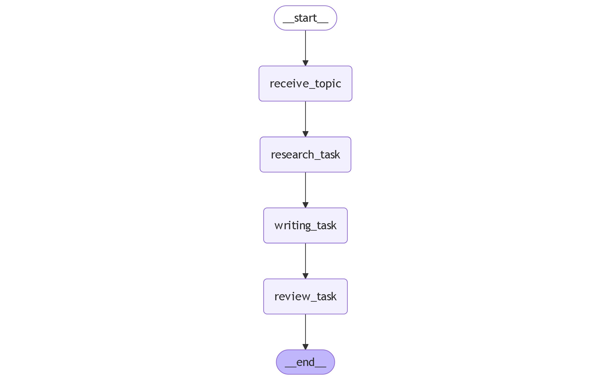

# LangGraph + CrewAI

Este projeto demonstra como combinar LangGraph e CrewAI, utilizando o modelo Gemini da Google, para criar um fluxo inteligente de escrita automatizada com múltiplos agentes especializados (pesquisa, redação e revisão).

## 🧠 Diagrama do fluxo



## 🚀 Tecnologias utilizadas

- **LangGraph**: para orquestrar o fluxo entre os agentes
- **CrewAI**: para definir e executar tarefas com agentes autônomos
- **Gemini (Google AI)**: modelo LLM usado por todos os agentes

## ⚙️ Pré-requisitos

- Python 3.9+
- Conta no Google AI Studio com acesso ao Gemini
- Variável de ambiente `GOOGLE_API_KEY` configurada no seu `.env`

## 📦 Instalação e execução

Clone o repositório, instale as dependências e execute o projeto:

```bash
pip install -r requirements.txt
python main.py
```
